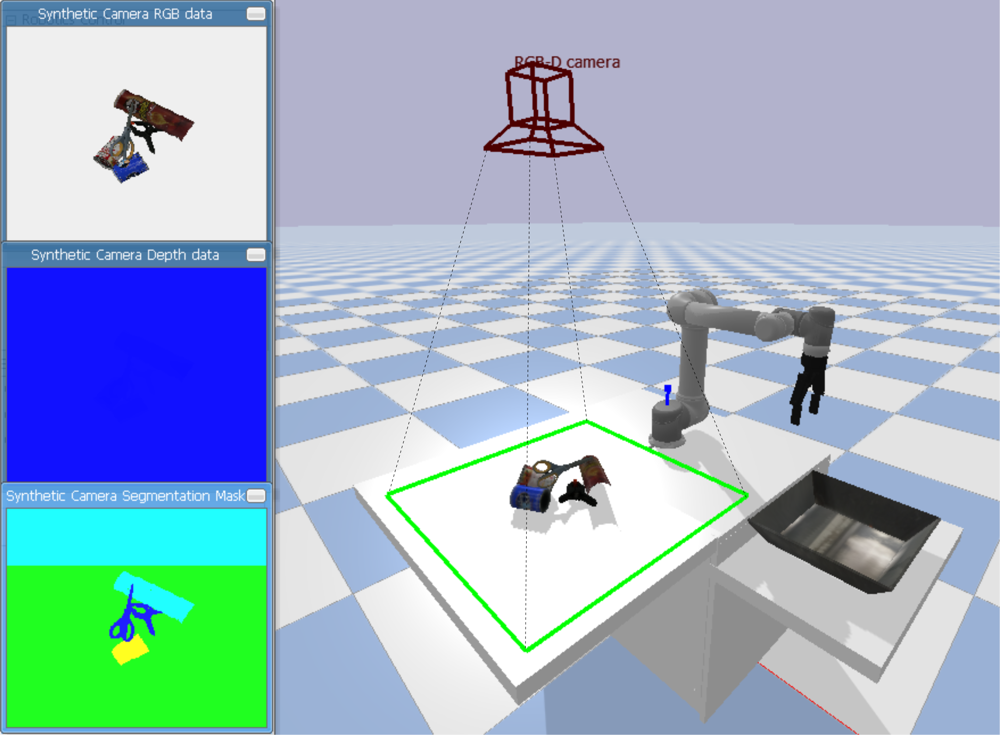
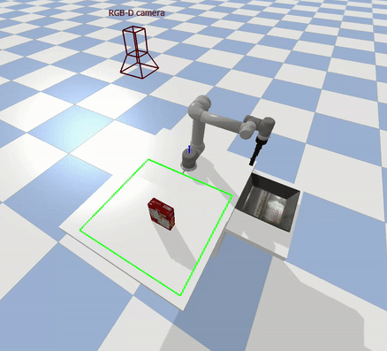
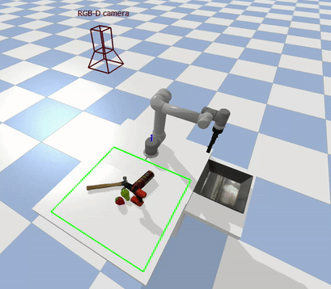
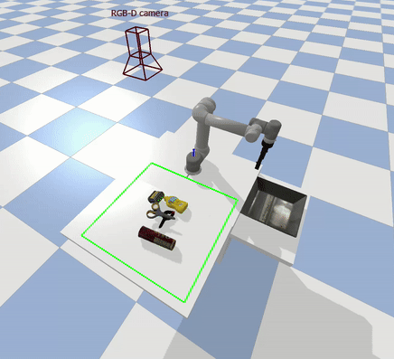

## Coupling between Perception and Manipulation: Learning to Grasp Objects in Highly Cluttered Environments

###### [Hamidreza Kasaei](https://hkasaei.github.io/) | [cognitive robotics course](https://rugcognitiverobotics.github.io/) | [assignment description](https://github.com/SeyedHamidreza/cognitive_robotics_manipulation/blob/main/assignment_description.pdf) | [IRL-Lab](https://www.ai.rug.nl/irl-lab)
##


# Assignment Overview
Service robots typically use a perception system to perceive the world. The perception system provides valuable information that the robot has to consider for interacting with users and environments. A robot needs to know how to grasp and manipulate objects in different situations to assist humans in various daily tasks. For instance, consider a robotic task such as clear table. Such tasks consist of two phases: the first one is the perception of the object, and the second phase is dedicated to the planning and execution of the manipulation task. In this assignment, you mainly focus on the topic of deep visual object grasping and manipulation.

The main goal of this assignment is to make a coupling between perception and manipulation using eye-to-hand camera coordination. Towards this goal, we have developed a simulation environment in [PyBullet](https://pybullet.org/wordpress/), where a Universal Robot (UR5e) with a two-fingered Robotiq 2F-140
gripper perceives the environment through an RGB-D camera. The experimental setup for this assignment is shown in the following figure. This setup is very useful to extensively evaluate different object grasping approaches.


In this assignment, we are pursuing three main goals: (i) learning about at least two deep visual grasping approaches, (ii) evaluating and comparing their performances in three scenarios: isolated, packed, and pile (see scenarios below); (iii) investigating the usefulness of formulating object grasping as an object-agnostic problem for general purpose tasks. You can also use this setup to develop your final course project.


<p align="center">
  
</p>
<p align="left">
  Our experimental setup consists of a table, a basket, a URe5 robotic arm, and objects from YCB dataset. The green rectangle shows the robot's workspace, and the camera indicates the pose of the camera in the environment. Synthesis RGB and depth images, together with a segmentation mask are shown on the left side of the figure.
</p>


<p align="center">
  
  
  
</p>
<p align="left">
   Three scenarios: (left) isolated scenario, (center) packed scenario, and (right) pile scenario. The green line denotes the camera’s line of sight.
</p>

## Requirements

Ensure you are running Python>=3.6.5 and import the required libraries by running:
```
pip3 install -r requirements.txt
```

It will install a set of packages, including: numpy, opencv-python, matplotlib, scikit-image, imageio, torch, torchvision, torchsummary, tensorboardX, pyrealsense2, Pillow, pandas, matplotlib, pybullet

## How to run an experiment
We can perform a simulation experiment by running the 'simulation.py' script. As shown in the following image, we can perform experiments in three different grasping scenarios, including isolated, packed, and pile scenarios:

<p align="center">
  
</p>


- Example:

```bash
python3 simulation.py --scenario=pile --network=GR_ConvNet --runs=10 --save-network-output=True
```


  - Run 'simulation.py --help' to see a full list of options.
    
      - In the ***environment/env.py*** file, we have provided a parameter namely ***SIMULATION_STEP_DELAY*** to control the speed of the simulator, this parameter should be tuned based on your hardware. 
       
      - After performing all the experiments, a summary of the results will be visualized and saved in the ***results*** folder.

      - Furthermore, you can check the output of the network by setting the ***--save-network-output=True***. The output will be saved into the ***network_output*** folder

## References

- Simulation
  - The simulation code is an adaptation from the following repositories: 
      - https://github.com/ElectronicElephant/pybullet_ur5_robotiq  
      - https://github.com/JeroenOudeVrielink/ur5-robotic-grasping
  - Object models were taken from the following repository: https://github.com/eleramp/pybullet-object-models
  


- Networks that you can use
  - GR-CONV [default]: https://github.com/skumra/robotic-grasping 
  - GGCNN:  https://github.com/dougsm/ggcnn
  - C_GR_ConvNet: https://github.com/krishkribo/3D_GDM-RSON
  - VGN: https://github.com/ethz-asl/vgn
  - GDP: https://github.com/ethz-asl/vgn
   

- Papers:
   - Hamidreza Kasaei and Mohammadreza Kasaei. MV-grasp: Real-time multi-view 3D object grasping in highly cluttered environments. arXiv preprint arXiv:2103.10997, 2021
  
  - Oude Vrielink, Jeroen, Hamidreza Kasaei. Learning to grasp objects in highly cluttered environments using Deep Convolutional Neural Networks. BSc Diss. 2021.
  
  - Sulabh Kumra, Shirin Joshi, and Ferat Sahin.  Antipodal robotic grasping using generative residual convolutional neural network. In 2020 IEEE/RSJ International Conference on Intelligent Robots and Systems(IROS), pages 9626–9633, 2020. doi: 10.1109/IROS45743.2020.9340777.


## TODO

- Add a param to save/not save the results
